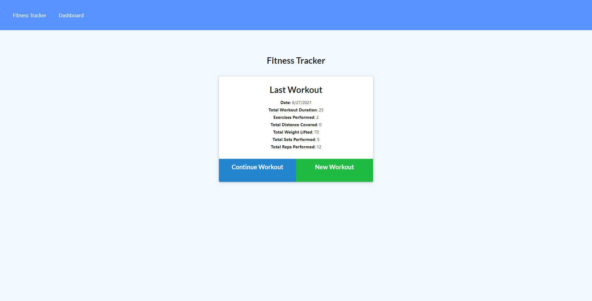
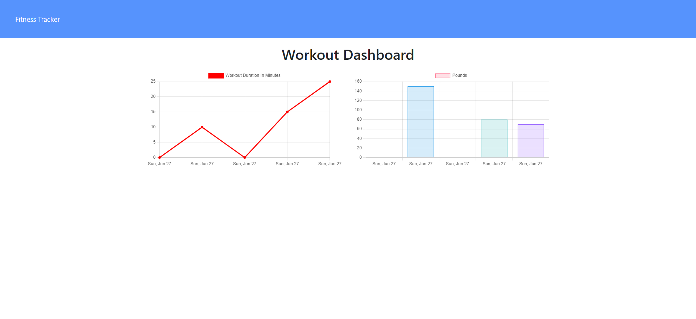

# 18-Nosql-Workout-Tracker


## Summary

This is a fitness app that allows you to log and track all the exercises you've preformed in a day.  It also tracks whether or not it's resistance or cardio. The type, name, distance travelled, time, weight, sets and reps of your exercise. It also includes a dashboard where you can track your fitness thoughtout the week visually via Pounds graph and Duration in Minutes graph.


# Table of Contents

- [Summary](#summary)
- [Installation](#installation)
- [Deployed Link](#deployed-link)
- [Screen Shots](#screen-shots)
- [Credit](#credit)


# Installation
```
Packages include: 

Express

Mongoose

Morgan

```


# Screen Shots



 

